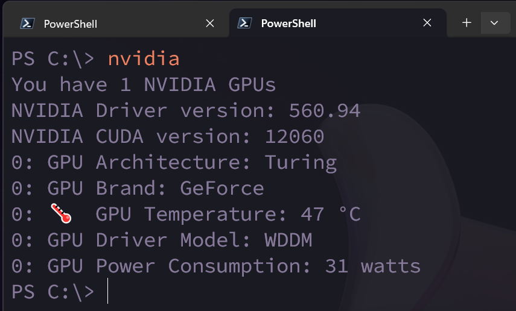

# NVIDIA CLI

This is a command line tool to interface with NVIDIA GPUs.



# Installation 

Ensure that the [Rust toolchain](https://rustup.rs) is installed on your system.

```bash
cargo install nvidia
```

# Usage

Run this command:

```
nvidia
```

# Uninstallation

You can remove the NVIDIA CLI tool with the following command:

```
cargo uninstall nvidia
```

# License

MIT
